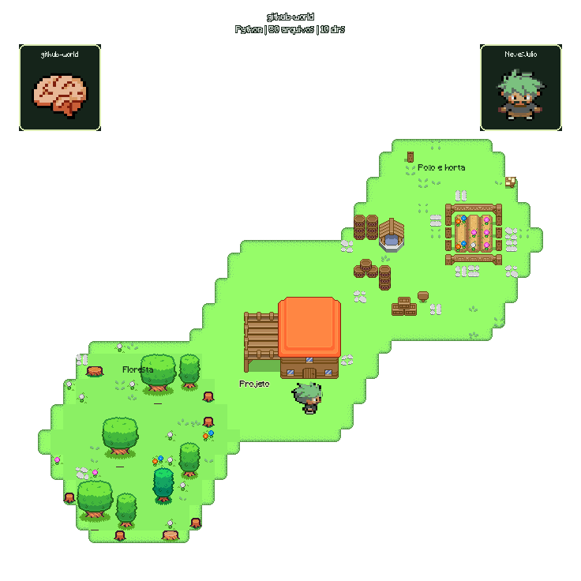

# github-world

Mapa em pixel art que representa os principais repositórios do GitHub como ilhas, atualizado automaticamente por cron no GitHub Actions. Cada ilha usa a árvore real de arquivos para formar uma colônia de módulos hexagonais conectados, com crescimento orgânico.



## Executar

Requer Python 3.11 ou superior.

```bash
python3 -m pip install -r requirements.txt
python3 generate.py
```

Por padrão, consulta apenas o repositório público mais recentemente atualizado de `NevesJulio`, sem forks. Para outro usuário:

```bash
python3 generate.py --username SEU_USUARIO
```

Para voltar a mostrar dois ou três repositórios, use `--limit 2` ou `--limit 3`. Alterar o valor padrão de `get_top_repositories()` em `github_activity.py` não muda o gerador principal; quem controla a quantidade é o argumento `--limit` de `generate.py`.

A variável opcional `GITHUB_TOKEN` autentica as consultas e aumenta o limite de requests. O token nunca é salvo no snapshot. O workflow usa o token disponibilizado pelo GitHub Actions e atualiza `map.png` e `world.gif` a cada seis horas.

Os caminhos dos assets são relativos aos arquivos Python: o gerador também funciona quando executado de outro diretório. As saídas vão para a raiz do projeto por padrão; use `--output-dir /tmp/meu-mapa` para escolher outro destino.

## Executar sem rede ou sandbox com acesso ao GitHub

```bash
python3 generate.py --offline --output-dir /tmp/meu-mapa
```

Esse modo representa a árvore local deste projeto em uma ilha. Diretórios de ferramentas, caches e dependências instaladas são ignorados. A linguagem é identificada como Python para este projeto; atividade e tempo sem atualização ficam desconhecidos, sem métricas simuladas.

Para salvar dados reais e repetir exatamente a mesma geração sem novas consultas:

```bash
python3 generate.py --save-data /tmp/repos.json
python3 generate.py --data /tmp/repos.json --output-dir /tmp/meu-mapa
```

O JSON contém uma lista de repositórios com `name`, `tree` (entradas com `path` e `type`), `main_language`, `languages` (bytes por linguagem), `topics`, `recent_commits`, `pushed_at` e `as_of`. O layout e a decoração são determinísticos para os mesmos dados e assets, usando uma semente por nome de repositório e frames ordenados.

## Significado visual

| Dados | Representação |
| --- | --- |
| Repositório | Uma ilha com nome e contagem de arquivos/diretórios |
| Diretórios principais e arquivos da raiz | Até três construções identificadas por rótulos |
| Arquivos por diretório | Variante 1 abaixo de 20 arquivos, 2 de 20 a 79, 3 a partir de 80 |
| Quantidade de bairros | Novos módulos de casas anexados a um dos seis lados livres |
| Profundidade dos arquivos | Mais folhagem no jardim, limitada a três elementos adicionais |
| Python, R, Julia, Jupyter Notebook | Casas verdes |
| C, C++, Rust, Go, Java | Casas cinza |
| Outras linguagens ou linguagem desconhecida | Casas laranja |
| Linguagens secundárias | Cores das construções auxiliares |
| Commits nos últimos 30 dias | Caixas e barris, até oito elementos |
| Mais de 90 dias sem push | Fonte vazia e mais árvores |
| Push há até 90 dias | Fonte cheia |
| Testes identificados pelo caminho/nome | Cercas na praça |
| README ou diretórios de documentação | Placa na praça |
| Manifestos de dependências | Depósito ou caixa na praça |
| Tópicos de pesquisa, hardware ou web | Diferentes grupos de árvores e vegetação |

Quando há mais de três bairros, os dois com mais arquivos aparecem individualmente e os demais são somados na casa `(outros)`. A interpretação dos dados mantém até seis grupos; o layout compacto reúne esses grupos em até três casas sem perder a contagem de arquivos. Arquivos da raiz formam o bairro `(raiz)`. Repositórios vazios recebem uma construção com o rótulo `(sem arquivos)`.

Os assets de casas 1 e 2 têm a mesma área de recorte, mas desenhos diferentes; a variante 3 é maior. As métricas orientam escolhas visuais, sem representar uma medida formal de qualidade do projeto. Dependências são contadas por manifestos detectados, sem analisar pacotes individuais.

A coleta usa a árvore da branch padrão, linguagens e até 100 commits dos últimos 30 dias. Essa contagem de commits é limitada a 100. Árvores truncadas ou indisponíveis recebem `*` no nome da ilha; suas contagens são parciais. Falhas nas métricas auxiliares geram avisos e não se tornam atividade zero. Se a listagem principal falhar, o comando termina com erro e orienta usar `--offline` ou um snapshot. Ele não substitui repositórios reais por nomes fictícios.

## Crescimento em honeycomb

Cada colônia começa com uma praça, recebe até três módulos de casas e um jardim: no máximo cinco hexágonos por repositório. Documentação, testes e dependências compartilham a praça, evitando módulos extras. A escolha considera o nome do repositório e a identidade do módulo, com variações reproduzíveis que deixam braços e espaços vazios no contorno.

Cada hexágono tem 16 × 16 tiles, com 20% menos área de terreno que a versão anterior. As casas 1 e 2 mantêm seus sprites; a casa 3 usa uma variante de 10 × 7 tiles, redimensionada com vizinho mais próximo para preservar a nitidez da pixel art. Os recortes originais continuam no catálogo. Os lados compartilhados desaparecem na renderização: a ilha tem terreno contínuo, jardins com tonalidade suave e uma costa em degraus de pixel art. Os caminhos ligam as portas e os módulos, contornam construções e chegam às pontes. O personagem caminha sobre um trecho real desses caminhos.

Aumentar a quantidade de arquivos de um bairro troca o sprite sem alterar suas coordenadas hexagonais quando os bairros visíveis permanecem os mesmos. Mudanças no ranking dos dois maiores bairros podem mudar o agrupamento e o layout. Adicionar ou remover diretórios pode reorganizar módulos posteriores: esta versão recalcula o layout e ainda não persiste um histórico de posições. A vegetação do jardim também reflete a profundidade da árvore e o tempo sem atualização. O crescimento prioriza posições próximas da praça para manter a composição compacta.

O PNG e o GIF têm fundo transparente. No GIF, um índice da paleta é reservado para transparência em todos os frames; o contorno dos rótulos permite lê-los sobre fundos claros ou escuros.

## Organização

- `github_activity.py`: coleta dados brutos da API, com autenticação, paginação e timeout.
- `repo_profile.py`: cria `RepoProfile` e `DirectoryProfile` com identidade e métricas.
- `layout.py`: posiciona ilhas, construções, caminhos e decorações respeitando o tamanho dos sprites.
- `renderer.py`: desenha camadas, etiquetas, pontes e animação do personagem.
- `generate.py`: coordena o processo e fornece as opções de linha de comando.
- `assets.py`: catálogo único, preservando todos os IDs da antiga V2 e incluindo assets exclusivos da configuração antiga.
- `tiles.py`: classes `Tile` e `AssetManager`.

Os assets ficam em `assets/`. Os frames do personagem ficam em `assets/me/frente`, `assets/me/costas` e `assets/me/lado`; a animação atual usa os frames laterais, ordenados pelo nome do arquivo.

## Adicionar assets

Registre o sprite em `assets.py` com `assets.add(Tile(...))`. `col` e `row` indicam a posição no tileset; `width` e `height` são medidas em tiles de 16 pixels. Use um ID novo e, para decoração, adicione-o ao grupo apropriado ou às regras de `layout.py`.

Os IDs `g`, `e`, `r`, `c`, `f`, `co`, `cc`, `cv`, `p`, `x`, `y` e `m` mantêm o catálogo V2. As árvores antigas usam `t1` a `t8`; os pisos antigos usam `floor1` a `floor10`, a grama antiga `grass1` a `grass8` e as construções de madeira `wood1` a `wood3`. Os nomes próprios evitam substituir os IDs da V2. `path1` é o tile de terra usado nos caminhos. As variantes `co3_compact`, `cc3_compact` e `cv3_compact` são derivadas dos sprites originais para o layout menor.

A origem e a situação das licenças dos sprites estão registradas em [assets/SOURCES.md](assets/SOURCES.md). Ainda faltam os créditos e as licenças originais; não foi atribuída uma licença presumida aos desenhos.

## Validar

```bash
python3 -m unittest discover -s tests -v
```

Os testes cobrem agrupamento de arquivos, métricas desconhecidas, paginação com forks, limites dos recortes, módulos anexados por lados compartilhados, caminhos conectados, posicionamento sem sobreposição reprodução idêntica dos arquivos PNG/GIF com os mesmos dados e transparência do fundo em todos os frames da animação.
